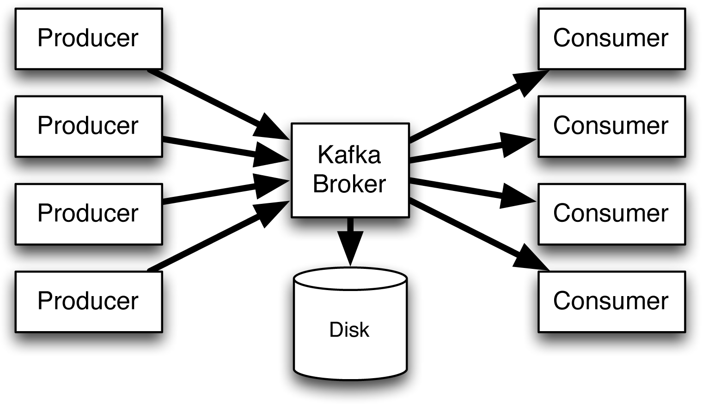

## nest-microservices practice

</img>

## Installation

```bash
1. npm install (for each microservices)
2. docker-compose up (for each microservices)
```

## Configuration

```bash
--nest-ambassador service
CHECKOUT_URL=<checkout frontend url>
STRIPE_KEY=<input your stripe key>

--microservices common
CONFLUENT_CLUSTER_SERVER=<input your apache kafka cluster url>
CONFLUENT_API_KEY=<input your api_key>
CONFLUENT_SECRET_KEY=<input your secret_key>
```

## Running the app

```bash
# development
$ npm run start

# watch mode
$ npm run start:dev

# production mode
$ npm run start:prod
```

## Test

```bash
# unit tests
$ npm run test

# e2e tests
$ npm run test:e2e

# test coverage
$ npm run test:cov
```

## Seeding

```
# ex) npm run seed:ambassadors
"seed:ambassadors": "ts-node src/commands/ambassador.seeder.ts",
"seed:products": "ts-node src/commands/product.seeder.ts",
"seed:orders": "ts-node src/commands/order.seeder.ts"
```

## License

Nest is [MIT licensed](LICENSE).
